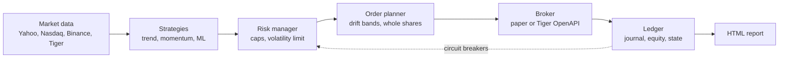

# Kea

**A risk-first autonomous trading agent for a Tiger Brokers account.** Once a month Kea
reads the market, decides what a diversified portfolio of eight ETFs (US and
international stocks, Treasuries, corporate bonds, gold and commodities) should hold,
sizes it for the risk it is willing to take, and places the orders. Every decision is journaled, every
day's equity is recorded, and the agent stops itself and waits for a human when something
looks wrong.

Kea is named after the alpine parrot from Aotearoa: clever, curious and impossible to
keep out of things.

> **Status: paper trading.** Kea trades a simulated account (or a Tiger *paper* account)
> by default. Real money takes two deliberate switches, and nothing here is financial
> advice. See [Safety](#safety) and [What the evidence says](#what-the-evidence-says).

## What it does



* **Rules with a century of evidence.** Multi-horizon *trend following* (does each
  ETF beat T-bills over 1, 3, 6 and 12 months?) blended with *dual momentum* (the top
  three ETFs by 12-1 month return, if they beat cash).
* **Machine learning, held to account.** A gradient-boosted forecaster, refit every
  quarter on data available at the time, predicts which ETFs beat cash next month. Kea
  scores its out-of-sample skill on every run, and keeps it out of the default
  portfolio until it shows some.
* **Risk before return.** Long-only, never leveraged, at most 35% in one ETF, and
  exposure is cut whenever predicted volatility exceeds 10% a year.
* **Circuit breakers.** A 25% drawdown or a 6% day halts the agent until someone runs
  `kea resume`. Stale or implausible data skips the day instead of trading on it.
* **Data that works anywhere.** Prices come from Yahoo where it answers and Nasdaq
  otherwise (Yahoo blocks most cloud servers). Nasdaq's prices are adjusted for
  dividends by Kea itself, which is why the default ETFs are Nasdaq-listed.
* **Real costs.** Tiger Brokers NZ's actual fee schedule (USD 2 per order up to 200
  shares, plus pass-through fees), slippage, whole shares, and fills at the *next* open.
* **Honest scoring.** Every comparison asks whether a strategy genuinely beats
  buy-and-hold, deflated for how many variants were tried (Bailey and López de
  Prado's deflated Sharpe ratio), so a lucky backtest cannot pass as skill.

## Quick start

Python 3.11 or newer.

```bash
python -m venv .venv && source .venv/bin/activate
pip install -e ".[tiger,dev]"

kea data                         # fetch prices, show where each series came from
kea compare --sizes                # the strategy vs buy-and-hold, plus fee drag by account size
kea run --dry-run                # what would the agent do right now?
kea run                          # one real paper-trading decision cycle
kea status                       # account, positions, recent decisions
kea report                       # dashboard: live record + backtest
```

`kea run` is safe to repeat: it handles each completed trading session once, and later
runs that day do nothing. Settings live in [`config/default.toml`](config/default.toml);
any of them can be overridden on the command line, e.g. `kea -s risk.target_vol=0.08 compare`.

## Connecting Tiger Brokers

Kea never stores credentials. The Tiger SDK reads them from environment variables or
from the properties file Tiger generates for you.

1. **Register as a developer** at the [Tiger Developer Center](https://developer.itigerup.com/profile)
   (it needs a funded account and an API agreement). Save the RSA private key shown
   during registration straight away: Tiger does not keep a copy.
2. **Use the paper account.** Your developer page lists a 17-digit paper trading account
   alongside your real one. Start there.
3. **Download `tiger_openapi_config.properties`** from the developer page and keep it
   outside this repository (it is git-ignored anyway). Then either point at it:
   ```bash
   export TIGEROPEN_PROPS_PATH=~/secrets/tiger_openapi_config.properties
   ```
   or set `TIGEROPEN_TIGER_ID`, `TIGEROPEN_PRIVATE_KEY` and `TIGEROPEN_ACCOUNT` (the
   paper account number).
4. **Convert some NZD to USD** in the Tiger app: the ETFs trade in USD.
5. **Try it:** `kea -c config/tiger-paper.toml run --dry-run`, then schedule
   `kea -c config/tiger-paper.toml run` for US market hours (around 10:30 New York time)
   on weekdays. Decisions use the previous session's close and market orders fill near
   the open, which is what the backtest assumes.

Details: [Tiger OpenAPI quick start](https://docs-en.itigerup.com/docs/quickstart-python).

## Running it autonomously

[`.github/workflows/paper-trading.yml`](.github/workflows/paper-trading.yml) runs one
decision cycle after every US close and commits the paper account, journal, equity
curve and dashboard to a `paper-ledger` branch. That branch's commit history is a
timestamped record nobody can quietly edit, which is what makes a track record
believable. A halt or an error fails the workflow, so GitHub emails you.

Scheduled workflows run from the default branch, so this starts once the code is on
`main`. To paper trade a Tiger account from Actions instead of the built-in simulator,
add the three `TIGEROPEN_*` values as repository secrets and point the workflow at
`config/tiger-paper.toml` with a market-hours schedule.

## Safety

| Risk | What Kea does |
|---|---|
| Real money by accident | Refuses a non-paper Tiger account unless `broker.allow_live = true` **and** `KEA_ALLOW_LIVE=yes` |
| A crash in the market | 25% drawdown or 6% one-day loss halts trading until `kea resume` |
| Bad or stale data | Skips the day if any price is missing, stale, or moved more than 35% |
| Running twice | Each session is handled once; a lock file stops overlapping runs |
| Leverage or shorting | Impossible: long-only weights capped at 100% of equity, buys shrink to fit cash |
| Leaked keys | Credentials only come from the environment; key files are git-ignored |
| Trying it out | `kea run --dry-run` plans everything and changes nothing |

## What the evidence says

Reproduce everything with `kea -c config/default.toml report --strategies trend,momentum,ml,ensemble --study config/century.toml --study config/small-account.toml`.
Returns are after Tiger's fees and slippage, with dividends reinvested. "Beats B&H"
is the probability that a strategy's Sharpe ratio genuinely beats buy-and-hold's
after discounting for every variant tried ([`TRIALS.md`](TRIALS.md)).

**The ETF portfolio, Jan 2021 to Oct 2026** (USD 10,000, 9 trials counted)

| Strategy | Annual return | Volatility | Sharpe | Worst fall | Beats B&H |
|---|---:|---:|---:|---:|---:|
| **Kea default (trend + momentum)** | **6.1%** | 8.4% | 0.56 | **13.1%** | 2% |
| Dual momentum alone | 8.7% | 10.3% | 0.71 | 13.8% | 5% |
| Trend following alone | 1.6% | 4.4% | 0.03 | 12.3% | 0% |
| ML forecaster | 0.4% | 5.0% | -0.20 | 14.3% | 0% |
| Buy and hold VONE (≈ S&P 500) | 13.8% | 16.4% | 0.78 | 24.7% | |
| 60/40 stocks and bonds | 7.3% | 10.5% | 0.58 | 21.7% | |

**A century of US stocks, 1927 to 2026** (Kenneth French's market and T-bill
indices, 10 bps per trade, 5 trials counted)

| Strategy | Annual return | Volatility | Sharpe | Worst fall | Worst year | Beats B&H |
|---|---:|---:|---:|---:|---:|---:|
| Trend following | 8.1% | 10.3% | 0.48 | 54.0% | -22.2% | 19% |
| Dual momentum | 9.4% | 12.9% | 0.50 | 49.6% | -18.4% | 23% |
| 200-day filter | 8.9% | 12.4% | 0.48 | 61.6% | -21.6% | 17% |
| Ensemble | 8.9% | 11.3% | 0.51 | 53.6% | -17.9% | 28% |
| Buy and hold | 10.2% | 17.1% | 0.45 | 83.8% | -44.1% | |

What that adds up to:

* **Kea makes money, but it has not beaten simply holding the market.** Over
  2021-2026 it earned about half of buy-and-hold's return with about half the
  volatility and half the worst fall. Its risk-adjusted return was lower too.
* **Trend rules are crash insurance, not a market-beater.** Over a century they kept
  80-92% of the market's annual return with 24-40% less volatility, and their worst
  calendar year was -18% to -22% instead of -44%. Their worst falls were still 50-62%:
  the first leg of the 1929 crash came too fast for any monthly signal.
* **No strategy shows a reliable edge.** Even over 96 years, the best chance of
  genuinely beating buy-and-hold's Sharpe is 28%.
* **The machine-learning forecaster has no skill.** Its out-of-sample AUC was 0.475
  on ETFs, 0.483 on crypto and 0.520 over a century (0.5 is a coin flip), with worse
  calibration than always guessing the base rate. So it is off by default; turn it on
  with `-s 'strategy.members=["trend","momentum","ml"]'` to keep testing it.
* **Fees punish small accounts.** The default portfolio places about 45 orders a year:
  a drag of 1.4% a year on USD 2,000, 0.8% on USD 10,000 and 0.1% on USD 100,000. The
  [small-account rule](config/small-account.toml) trades about 5 times a year, but it
  lagged badly over 2017-2026 (4.9% a year against 14.7%) after being whipsawed by the
  fast 2020 crash.
* **Live paper results are the real test.** Backtests can be overfitted; a forward
  record committed daily cannot. Give it months, not days.

The numbers leave out taxes (US dividend withholding, NZ tax on foreign investments),
NZD/USD currency moves and conversion costs, and the hindsight in choosing which ETFs
to trade. The ETF backtest covers only about six years because free dividend-adjusted
data reaches back ten, and the trend signals need warm-up.

## Project layout

```
src/kea/
  config.py        typed settings from TOML, with helpful errors
  data/            providers (Yahoo, Nasdaq, Binance, Tiger, Ken French),
                   cache, session clock
  strategies/      trend, momentum, 200-day filter, ML forecaster, ensemble,
                   benchmarks
  risk.py          position caps, volatility cap, circuit breakers, data checks
  orders.py        the order planner shared by backtests and live trading
  costs.py         Tiger NZ fee schedule, slippage
  execution.py     simulated fills shared by the backtest and the paper broker
  backtest.py      event-driven backtester (signal at close, fill at next open)
  metrics.py       CAGR, Sharpe, drawdowns, probabilistic and deflated Sharpe
  research.py      strategy comparison and account-size sensitivity
  brokers/         paper broker and Tiger OpenAPI broker
  agent.py         the autonomous decision cycle
  ledger.py        agent state, journal, equity track record
  report.py        the HTML dashboard
config/            default (paper), tiger-paper, small-account,
                   century and crypto (research only)
tests/             fast, offline test suite
```

## Development

```bash
pytest            # about 90 tests, offline, a few seconds
ruff check . && ruff format --check .
```

[`TRIALS.md`](TRIALS.md) logs every strategy variant evaluated. Add to it whenever you
try something new and pass the running total to `kea compare --trials N`, or the
Deflated Sharpe Ratio will flatter you.

Built by Nik and Theo, with Claude Code.
