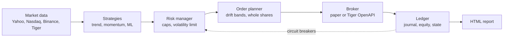

# Kea

**A risk-first autonomous trading agent for a Tiger Brokers account.** Once a month Kea
reads the market, decides what a diversified ETF portfolio should hold, sizes it for the
risk it is willing to take, and places the orders. Every decision is journaled, every
day's equity is recorded, and the agent stops itself and waits for a human when something
looks wrong.

Kea is named after the alpine parrot from Aotearoa: clever, curious and impossible to
keep out of things.

> **Status: paper trading.** Kea trades a simulated account (or a Tiger *paper* account)
> by default. Real money takes two deliberate switches, and nothing here is financial
> advice. See [Safety](#safety) and [What the evidence says](#what-the-evidence-says).

## What it does



* **Three signals, blended.** Multi-horizon *trend following* (does each ETF beat
  T-bills over 1, 3, 6 and 12 months?), *dual momentum* (the top three ETFs by 12-1
  month return, if they beat cash) and a *machine-learning forecaster* (gradient-boosted
  trees refit every quarter, predicting which ETFs beat cash next month).
* **Risk before return.** Long-only, never leveraged, at most 35% in one ETF, and
  exposure is cut whenever predicted volatility exceeds 10% a year.
* **Circuit breakers.** A 25% drawdown or a 6% day halts the agent until someone runs
  `kea resume`. Stale or implausible data skips the day instead of trading on it.
* **Real costs.** Tiger Brokers NZ's actual fee schedule (USD 2 per order up to 200
  shares, plus pass-through fees), slippage, whole shares, and fills at the *next* open.
* **Honest scoring.** Backtests report the Deflated Sharpe Ratio, which discounts a
  result for how many strategy variants were tried, and the ML model's out-of-sample
  AUC, so a lucky backtest cannot pass as skill.

## Quick start

Python 3.11 or newer.

```bash
python -m venv .venv && source .venv/bin/activate
pip install -e ".[tiger,dev]"

kea data                         # fetch prices, show where each series came from
kea compare --sizes --html reports/research.html   # every strategy vs buy-and-hold
kea run --dry-run                # what would the agent do right now?
kea run                          # one real paper-trading decision cycle
kea status                       # account, positions, recent decisions
kea report                       # dashboard: live record + backtest
```

`kea run` is safe to repeat: it handles each completed trading session once, and later
runs that day do nothing. Settings live in [`config/default.toml`](config/default.toml);
any of them can be overridden on the command line, e.g. `kea -s risk.target_vol=0.08 compare`.

## Connecting Tiger Brokers

Kea never stores credentials. The Tiger SDK reads them from environment variables or
from the properties file Tiger generates for you.

1. **Register as a developer** at the [Tiger Developer Center](https://developer.itigerup.com/profile)
   (it needs a funded account and an API agreement). Save the RSA private key shown
   during registration straight away: Tiger does not keep a copy.
2. **Use the paper account.** Your developer page lists a 17-digit paper trading account
   alongside your real one. Start there.
3. **Download `tiger_openapi_config.properties`** from the developer page and keep it
   outside this repository (it is git-ignored anyway). Then either point at it:
   ```bash
   export TIGEROPEN_PROPS_PATH=~/secrets/tiger_openapi_config.properties
   ```
   or set `TIGEROPEN_TIGER_ID`, `TIGEROPEN_PRIVATE_KEY` and `TIGEROPEN_ACCOUNT` (the
   paper account number).
4. **Convert some NZD to USD** in the Tiger app: the ETFs trade in USD.
5. **Try it:** `kea -c config/tiger-paper.toml run --dry-run`, then schedule
   `kea -c config/tiger-paper.toml run` for US market hours (around 10:30 New York time)
   on weekdays. Decisions use the previous session's close and market orders fill near
   the open, which is what the backtest assumes.

Details: [Tiger OpenAPI quick start](https://docs-en.itigerup.com/docs/quickstart-python).

## Running it autonomously

[`.github/workflows/paper-trading.yml`](.github/workflows/paper-trading.yml) runs one
decision cycle after every US close and commits the paper account, journal, equity
curve and dashboard to a `paper-ledger` branch. That branch's commit history is a
timestamped record nobody can quietly edit, which is what makes a track record
believable. A halt or an error fails the workflow, so GitHub emails you.

Scheduled workflows run from the default branch, so this starts once the code is on
`main`. To paper trade a Tiger account from Actions instead of the built-in simulator,
add the three `TIGEROPEN_*` values as repository secrets and point the workflow at
`config/tiger-paper.toml` with a market-hours schedule.

## Safety

| Risk | What Kea does |
|---|---|
| Real money by accident | Refuses a non-paper Tiger account unless `broker.allow_live = true` **and** `KEA_ALLOW_LIVE=yes` |
| A crash in the market | 25% drawdown or 6% one-day loss halts trading until `kea resume` |
| Bad or stale data | Skips the day if any price is missing, stale, or moved more than 35% |
| Running twice | Each session is handled once; a lock file stops overlapping runs |
| Leverage or shorting | Impossible: long-only weights capped at 100% of equity, buys shrink to fit cash |
| Leaked keys | Credentials only come from the environment; key files are git-ignored |
| Trying it out | `kea run --dry-run` plans everything and changes nothing |

## What the evidence says

Run `kea compare --sizes --html reports/research.html` to reproduce. The
[research workflow](.github/workflows/research.yml) runs the same comparison on
GitHub's servers for every change and posts the table in the job summary.

The honest summary so far:

* **Kea has not beaten simply buying and holding the S&P 500 over the last decade.**
  US stocks had an unusually strong run, and a diversified, risk-capped portfolio holds
  less of them. Kea's case rests on smaller drawdowns, not higher returns.
* **The machine-learning forecaster shows no out-of-sample skill** so far (AUC around
  0.47 to 0.48, where 0.5 is a coin flip), on ETFs and on crypto. It is kept because
  measuring that properly is the point; it is not kept because "AI" sounds good.
* **Fees matter a lot for small accounts.** At USD 10,000 the default portfolio pays
  roughly 1% a year in fees; at USD 100,000 it is about 0.1%. Whole shares of a USD 700
  ETF also distort a small portfolio. Size and universe should match the account.
* **Live paper results are the real test.** Backtests can be overfitted; a forward
  record committed daily cannot. Give it months, not days.

What the numbers leave out: taxes (US dividend withholding, NZ foreign investment
tax), NZD/USD currency moves and conversion costs, and the hindsight involved in
choosing which ETFs to trade.

## Project layout

```
src/kea/
  config.py        typed settings from TOML, with helpful errors
  data/            providers (Yahoo, Nasdaq, Binance, Tiger), cache, session clock
  strategies/      trend, momentum, ML forecaster, ensemble, benchmarks
  risk.py          position caps, volatility cap, circuit breakers, data checks
  orders.py        the order planner shared by backtests and live trading
  costs.py         Tiger NZ fee schedule, slippage
  execution.py     simulated fills shared by the backtest and the paper broker
  backtest.py      event-driven backtester (signal at close, fill at next open)
  metrics.py       CAGR, Sharpe, drawdowns, probabilistic and deflated Sharpe
  research.py      strategy comparison and account-size sensitivity
  brokers/         paper broker and Tiger OpenAPI broker
  agent.py         the autonomous decision cycle
  ledger.py        agent state, journal, equity track record
  report.py        the HTML dashboard
config/            default (paper), tiger-paper, crypto (research only)
tests/             fast, offline test suite
```

## Development

```bash
pytest            # about 90 tests, offline, a few seconds
ruff check . && ruff format --check .
```

[`TRIALS.md`](TRIALS.md) logs every strategy variant evaluated. Add to it whenever you
try something new and pass the running total to `kea compare --trials N`, or the
Deflated Sharpe Ratio will flatter you.

Built by Nik and Theo, with Claude Code.
